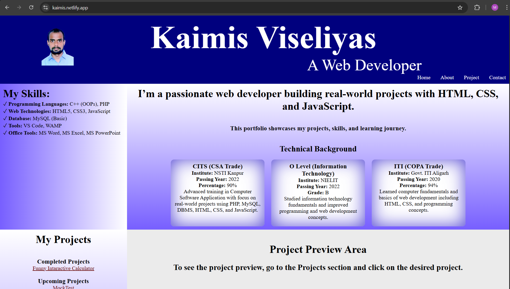
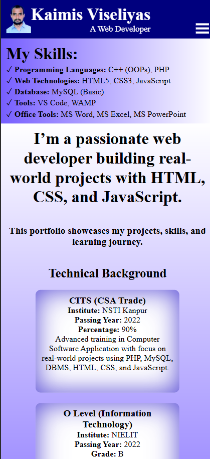
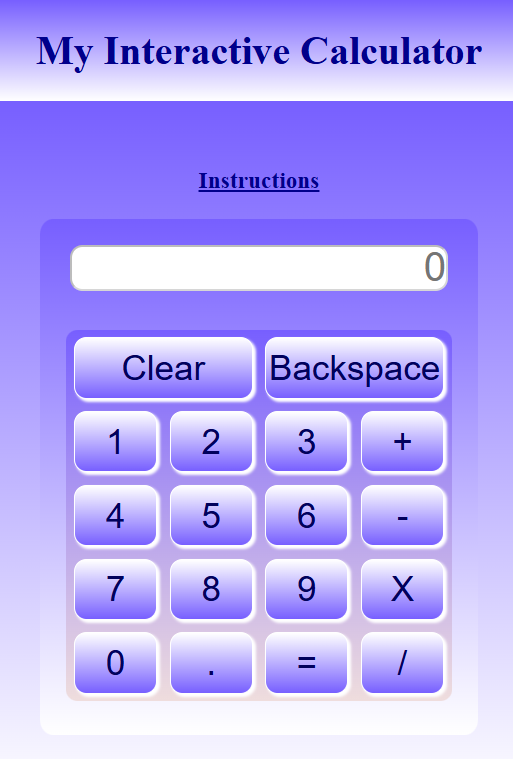
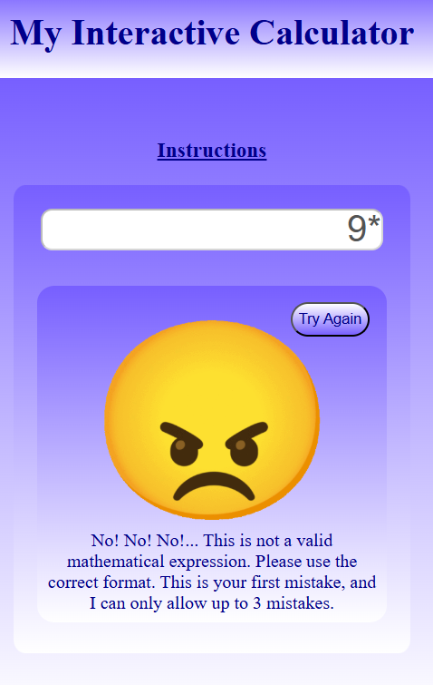
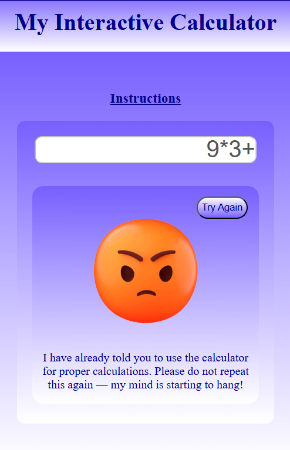

# Personal Developer Portfolio

A clean, responsive, and interactive personal portfolio website built with vanilla web technologies to showcase my projects, skills, and problem-solving abilities.

**Live Demo:** [https://kaimis.netlify.app](kaimis.netlify.app)

## Overview

This portfolio highlights my ability to develop fully functional web applications with a focus on user interaction and clean design. It includes a unique JavaScript project(Funny Interactive Calculator) that demonstrates creative problem-solving using only basic tools.

## Highlight Project: Funny Interactive Calculator

A humorous and interactive calculator built entirely with vanilla JavaScript. Unlike traditional calculators, it tracks user mistakes and responds dynamically with escalating behavior, creating an engaging experience.

### Key Features
- Real-time mistake tracking and state management
- Dynamic responses based on error count
- Fully interactive and simulated user behavior
- Built with pure HTML, CSS, and JavaScript (no libraries)

### Problem-Solving Approach
I implemented complex user interaction logic by breaking the problem into smaller modules and creating a custom state management system using only vanilla JavaScript. This project shows my ability to solve non-trivial challenges independently with simple tools.

## Tech Stack
- HTML5
- CSS3
- JavaScript (Vanilla)

## Screenshots

  
  





## Getting Started

```bash
# Clone the repository
git clone https://github.com/KaimisKumar/portfolio.git

# Go to the project folder
cd portfolio

# Open index.html in any browser
```
## Contact

* GitHub: https://github.com/KaimisKumar
* LinkedIn: https://in.linkedin.com/in/kaimis-kumar-505b24229

